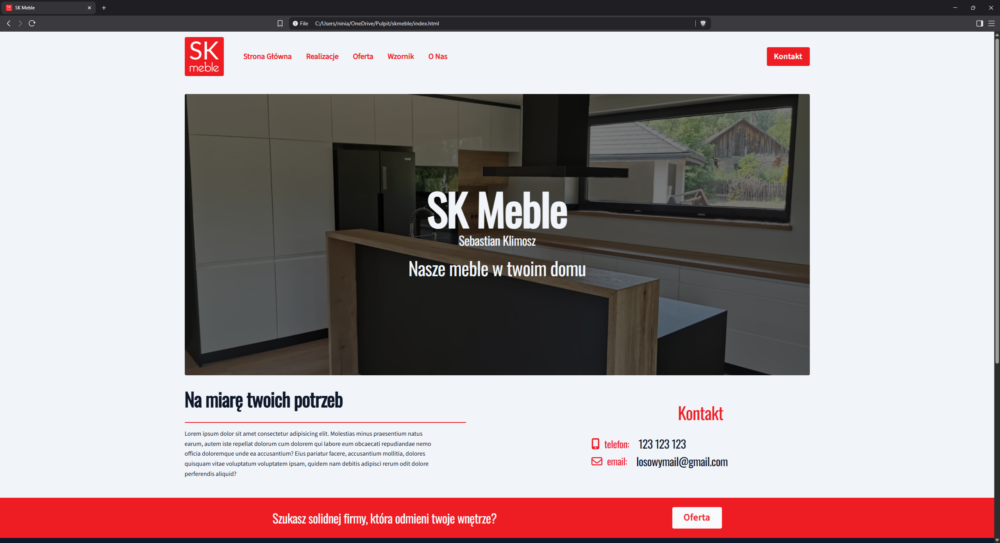

# SK-Meble

[Check the UI/UX](assets/SK%20Meble.pdf)

This is a website project I developed for the Polish company SK Meble.
Unfortunately, it was never published online due to personal circumstances on the client’s side.

The website was built entirely with HTML, CSS, and JavaScript, without the use of any frameworks or external libraries.